# GlobeBeats Backend Documentation

> Last Updated: 2025-01-04

## Overview

The backend is a FastAPI application providing REST APIs for music discovery, AI chat with RAG (Retrieval-Augmented Generation), and real-time data streaming.

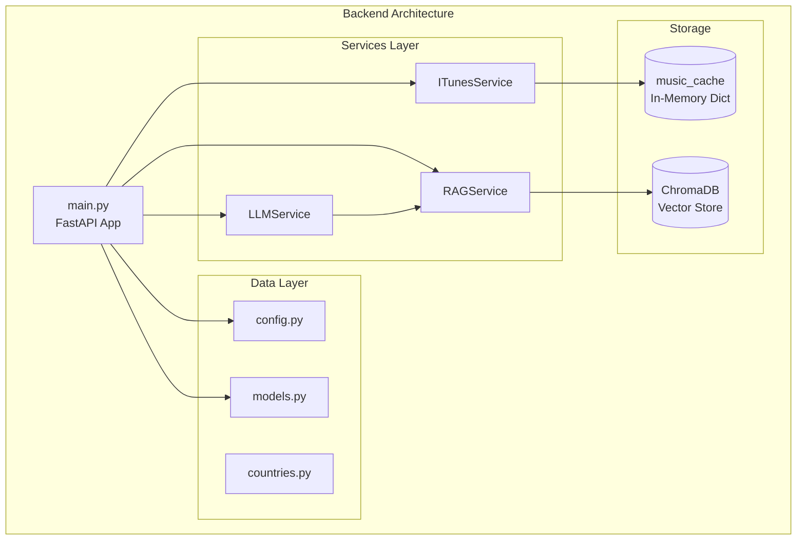

---

## File Structure

```
backend/
├── main.py                 # FastAPI app, endpoints, startup
├── config.py               # Pydantic settings
├── models.py               # Data models (Track, CountryMusic)
├── requirements.txt        # Python dependencies
├── Dockerfile              # Container build
├── railway.json            # Railway deployment
├── data/
│   ├── __init__.py
│   └── countries.py        # COUNTRIES list, get_country_name()
└── services/
    ├── __init__.py         # Service exports
    ├── itunes_service.py   # iTunes API integration
    ├── llm_service.py      # OpenAI/Anthropic chat
    ├── rag_service.py      # ChromaDB vector search
    ├── spotify_service.py  # Legacy (not used)
    └── lastfm_service.py   # Legacy (not used)
```

---

## Core Application

### File: `main.py`

The main FastAPI application with all endpoints and business logic.

#### Application Initialization

```python
from fastapi import FastAPI
from fastapi.middleware.cors import CORSMiddleware

app = FastAPI(title="GlobeBeats API")

# CORS middleware for frontend access
app.add_middleware(
    CORSMiddleware,
    allow_origins=settings.cors_origins.split(","),
    allow_credentials=True,
    allow_methods=["*"],
    allow_headers=["*"],
)
```

#### Global State

| Variable | Type | Purpose |
|----------|------|---------|
| `music_cache` | `Dict[str, CountryMusic]` | In-memory country data |
| `itunes_service` | `ITunesService` | iTunes API client |
| `rag_service` | `RAGService` | ChromaDB wrapper |
| `primary_llm_service` | `LLMService` | Primary LLM (Claude/GPT) |
| `fallback_llm_service` | `LLMService` | Fallback LLM |

#### Request/Response Models

```python
class ChatRequest(BaseModel):
    message: str
    conversation_history: List[Dict[str, str]] = []
    preferred_llm: str = "auto"  # "auto", "primary", "fallback"
    playlists: List[Dict] = []

class ChatResponse(BaseModel):
    response: str
    contexts: List[Dict] = []

class SearchRequest(BaseModel):
    query: str
    limit: int = 10
```

---

### API Endpoints

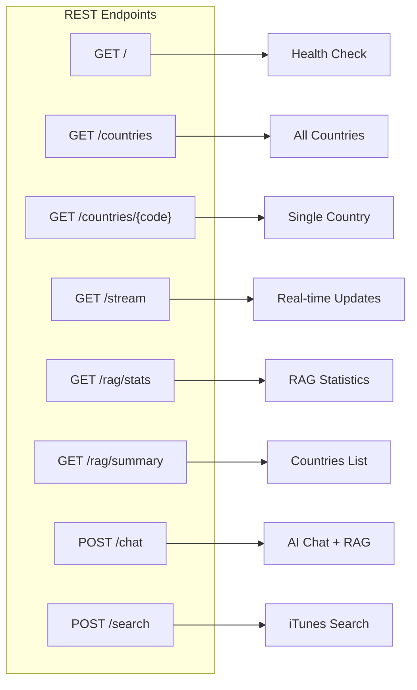

#### Endpoint Details

| Method | Path | Function | Description |
|--------|------|----------|-------------|
| GET | `/` | `health_check()` | Service status, LLM availability |
| GET | `/countries` | `get_countries()` | All 40 countries with tracks |
| GET | `/countries/{code}` | `get_country(code)` | Single country by ISO code |
| GET | `/stream` | `stream()` | SSE real-time updates |
| POST | `/chat` | `chat(request)` | AI chat with streaming |
| POST | `/search` | `search_tracks(request)` | iTunes track search |
| GET | `/rag/stats` | `get_rag_stats()` | Vector DB statistics |
| GET | `/rag/summary` | `get_rag_summary()` | Countries summary text |

---

### Key Functions

#### `fetch_country_music(country: dict) -> CountryMusic`

Fetches trending tracks for a single country from iTunes.

```python
async def fetch_country_music(country: dict) -> CountryMusic:
    """
    Fetch top 10 tracks for a country from iTunes RSS Feed.

    Args:
        country: Dict with country_code, country_name, lat, lng, flag

    Returns:
        CountryMusic object with tracks and metadata
    """
    tracks = await itunes_service.get_country_top_tracks(country["country_code"])
    return CountryMusic(
        country_code=country["country_code"],
        country_name=country["country_name"],
        latitude=country["lat"],
        longitude=country["lng"],
        flag=country.get("flag"),
        tracks=tracks,
        source="itunes",
        updated_at=datetime.now().isoformat()
    )
```

#### `update_music_data()`

Updates all countries in batches with rate limiting.

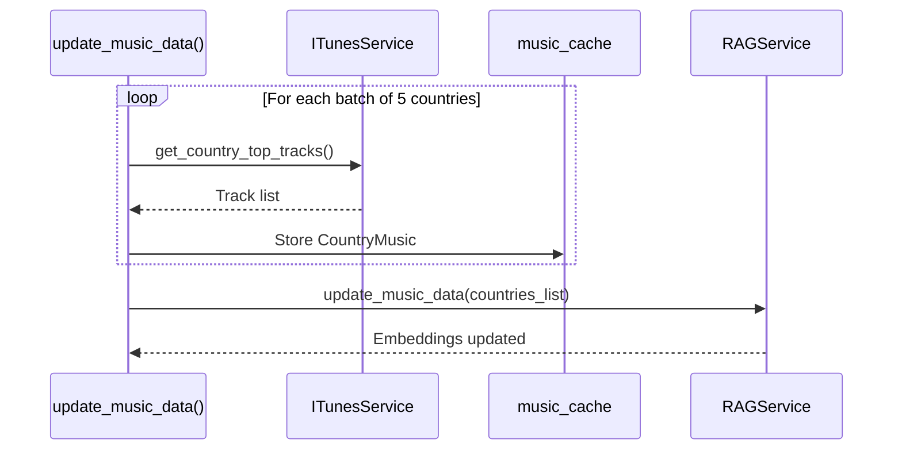

```python
async def update_music_data():
    """Update music data for all 40+ countries."""
    batch_size = 5
    for i in range(0, len(COUNTRIES), batch_size):
        batch = COUNTRIES[i:i + batch_size]
        tasks = [fetch_country_music(c) for c in batch]
        results = await asyncio.gather(*tasks, return_exceptions=True)

        for result in results:
            if isinstance(result, CountryMusic):
                music_cache[result.country_code] = result

        await asyncio.sleep(0.5)  # Rate limit

    # Update RAG database
    rag_service.update_music_data(list(music_cache.values()))
```

#### `periodic_update()`

Background task for continuous data refresh.

```python
async def periodic_update():
    """Background task: refresh data every UPDATE_INTERVAL seconds."""
    while True:
        await asyncio.sleep(settings.update_interval)  # Default: 300s
        await update_music_data()
```

#### `chat(request: ChatRequest)`

Main AI chat endpoint with streaming and fallback.

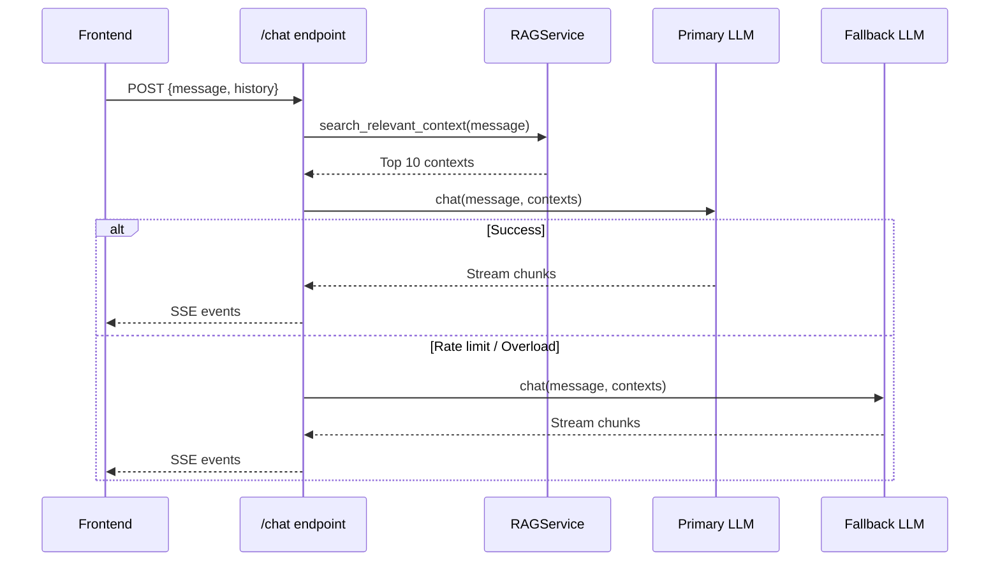

---

## Configuration

### File: `config.py`

Pydantic settings with environment variable loading.

```python
from pydantic_settings import BaseSettings

class Settings(BaseSettings):
    # API Keys
    spotify_client_id: str = ""
    spotify_client_secret: str = ""
    lastfm_api_key: str = ""
    openai_api_key: str = ""
    anthropic_api_key: str = ""

    # LLM Configuration
    llm_provider: str = "openai"  # or "anthropic"
    llm_model: str = ""
    openai_model: str = "gpt-4-turbo-preview"
    anthropic_model: str = "claude-sonnet-4-20250514"
    llm_fallback_enabled: bool = True

    # App Configuration
    cors_origins: str = "http://localhost:5174"
    update_interval: int = 300

    class Config:
        env_file = ".env"
        extra = "ignore"

settings = Settings()
```

### Configuration Flow

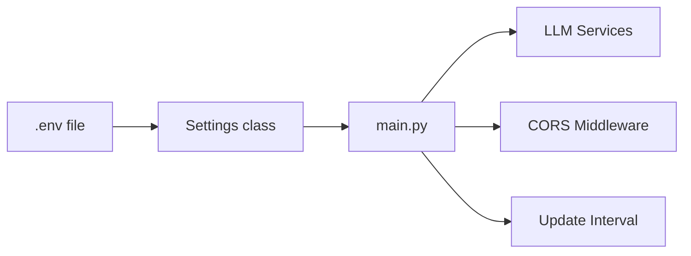

---

## Data Models

### File: `models.py`

```python
from pydantic import BaseModel
from typing import List, Optional

class Track(BaseModel):
    """Individual music track."""
    name: str
    artist: str
    preview_url: Optional[str] = None   # 30-second audio preview
    image_url: Optional[str] = None     # Album artwork
    external_url: Optional[str] = None  # iTunes Store link

class CountryMusic(BaseModel):
    """Country with trending tracks."""
    country_code: str                   # ISO code (US, GB, JP)
    country_name: str                   # Full name
    latitude: float
    longitude: float
    flag: Optional[str] = None          # Flag emoji
    tracks: List[Track]
    source: str                         # "itunes"
    updated_at: str                     # ISO timestamp
```

### Data Structure Diagram

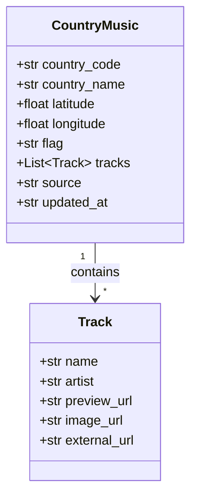

---

## Country Data

### File: `data/countries.py`

```python
COUNTRIES = [
    {"country_code": "US", "country_name": "United States",
     "lat": 37.0902, "lng": -95.7129, "flag": "🇺🇸"},
    {"country_code": "GB", "country_name": "United Kingdom",
     "lat": 55.3781, "lng": -3.4360, "flag": "🇬🇧"},
    {"country_code": "JP", "country_name": "Japan",
     "lat": 36.2048, "lng": 138.2529, "flag": "🇯🇵"},
    # ... 40+ countries total
]

def get_country_name(country_code: str) -> str:
    """Get country name from ISO code."""
    for country in COUNTRIES:
        if country["country_code"] == country_code:
            return country["country_name"]
    return country_code
```

### Supported Countries

| Region | Countries |
|--------|-----------|
| North America | US, CA, MX |
| Europe | GB, FR, DE, IT, ES, NL, SE, NO, PL, AT, CH, IE, BE, PT |
| Asia | JP, KR, CN, IN, TH, VN, ID, PH, SG, MY, TW, HK |
| Oceania | AU, NZ |
| South America | BR, AR, CO, CL |
| Middle East | IL, AE, SA, TR |
| Africa | ZA, EG, NG |

---

## Services

### ITunesService

#### File: `services/itunes_service.py`

```python
class ITunesService:
    """iTunes API integration for music data and search."""

    def __init__(self):
        self.client = httpx.AsyncClient(timeout=30.0)
        self.rss_base = "https://itunes.apple.com"
        self.search_base = "https://itunes.apple.com/search"
```

#### Methods

| Method | Parameters | Returns | Purpose |
|--------|------------|---------|---------|
| `get_country_top_tracks` | `country_code: str` | `List[Track]` | Top 10 trending from RSS |
| `search_tracks` | `query: str, limit: int` | `List[Track]` | Search iTunes catalog |
| `get_preview_url` | `track_name, artist, country` | `str` | Single preview URL lookup |

#### API Endpoints Used

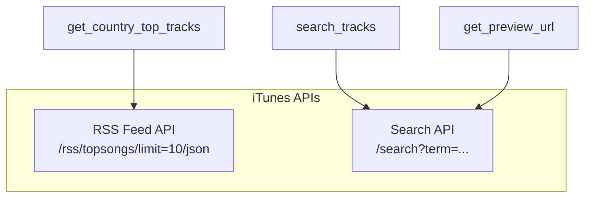

#### RSS Feed Flow

```python
async def get_country_top_tracks(self, country_code: str) -> List[Track]:
    """
    Fetch top 10 trending tracks from iTunes RSS Feed.

    URL: https://itunes.apple.com/{country}/rss/topsongs/limit=10/json

    Returns:
        List of Track objects with preview URLs for top 5
    """
    url = f"{self.rss_base}/{country_code}/rss/topsongs/limit=10/json"
    response = await self.client.get(url)
    data = response.json()

    tracks = []
    for i, entry in enumerate(data["feed"]["entry"][:10]):
        track = Track(
            name=entry["im:name"]["label"],
            artist=entry["im:artist"]["label"],
            image_url=entry["im:image"][-1]["label"],
            external_url=entry["link"][0]["attributes"]["href"]
        )

        # Get preview URL for top 5 tracks only
        if i < 5:
            track.preview_url = await self.get_preview_url(
                track.name, track.artist, country_code
            )

        tracks.append(track)

    return tracks
```

---

### LLMService

#### File: `services/llm_service.py`

```python
class LLMService:
    """OpenAI and Anthropic LLM integration with streaming."""

    def __init__(self, provider: str, api_key: str, model: str):
        self.provider = provider.lower()
        self.model = model

        if self.provider == "openai":
            self.client = AsyncOpenAI(api_key=api_key)
        elif self.provider == "anthropic":
            self.client = AsyncAnthropic(api_key=api_key)
```

#### Methods

| Method | Parameters | Returns | Purpose |
|--------|------------|---------|---------|
| `build_prompt` | `query, contexts, playlists` | `str` | System prompt construction |
| `chat` | `query, contexts, history, playlists` | `AsyncGenerator[str]` | Streaming chat |
| `_stream_openai` | `system_prompt, messages` | `AsyncGenerator[str]` | OpenAI streaming |
| `_stream_anthropic` | `system_prompt, messages` | `AsyncGenerator[str]` | Anthropic streaming |

#### LLM Provider Flow

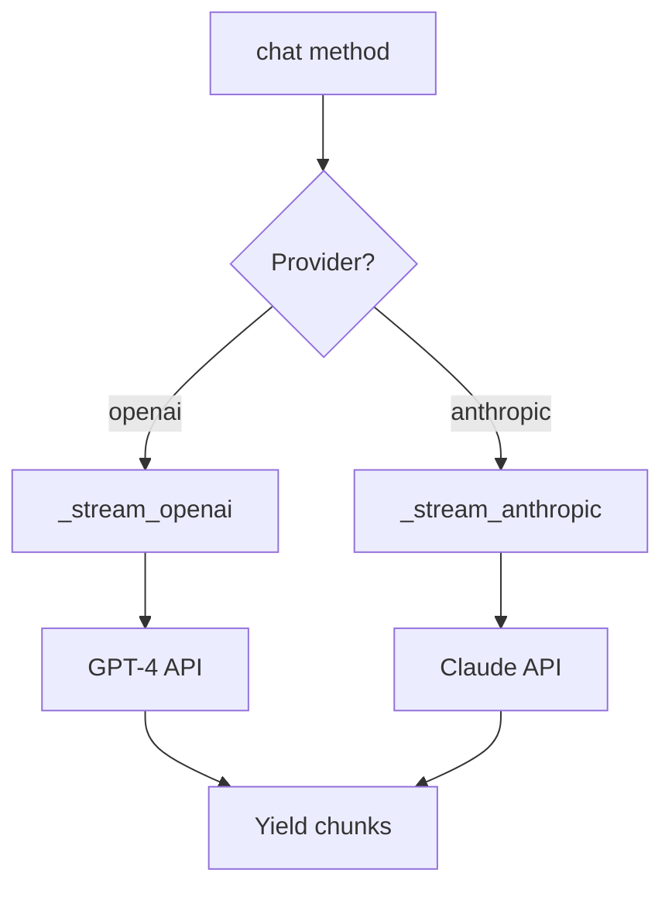

#### Action Tag System

The LLM is prompted to output action tags that the frontend executes:

```
Format: [ACTION:TYPE|PARAMS]

Types:
- SELECT_COUNTRY|CODE     → Zoom to country, show trending
- SHOW_SONG_LIST|QUERY    → Create playlist from iTunes search
- SEARCH_AND_PLAY|QUERY   → Search trending charts
```

#### System Prompt Structure

```python
def build_prompt(self, query, contexts, playlists):
    """Build system prompt with RAG context and action instructions."""

    return f"""
🎵 GlobeBeats Music AI - Music curator with playlist memory

**AVAILABLE ACTIONS:**
1. SELECT_COUNTRY|CODE - Zoom to country, show trending
2. SHOW_SONG_LIST|QUERY - Create playlist (20 songs)
3. SEARCH_AND_PLAY|QUERY - Search trending charts

**CRITICAL RULES:**
- NEVER repeat action tags
- ONE action per request
- Check playlists before creating new ones

**USER'S PLAYLISTS:**
{playlists_text}

**CURRENT TRENDING DATA:**
{context_text}
"""
```

---

### RAGService

#### File: `services/rag_service.py`

```python
class RAGService:
    """ChromaDB vector database for semantic search."""

    def __init__(self):
        self.client = chromadb.Client()  # In-memory
        self.collection = self.client.get_or_create_collection(
            name="music_data",
            embedding_function=embedding_functions.SentenceTransformerEmbeddingFunction(
                model_name="all-MiniLM-L6-v2"
            )
        )
```

#### Methods

| Method | Parameters | Returns | Purpose |
|--------|------------|---------|---------|
| `update_music_data` | `countries_data: List[Dict]` | `None` | Upsert embeddings |
| `search_relevant_context` | `query: str, n_results: int` | `List[Dict]` | Semantic search |
| `get_all_countries_summary` | - | `str` | Text list of countries |
| `get_stats` | - | `Dict` | DB statistics |

#### Document Format

```
Country: Japan (JP)
Data Source: itunes
Top Tracks:
- Idol by Yoasobi
- Subtitle by Official HIGE DANDism
- ...
Updated: 2025-01-04T12:00:00.000000
```

#### RAG Flow

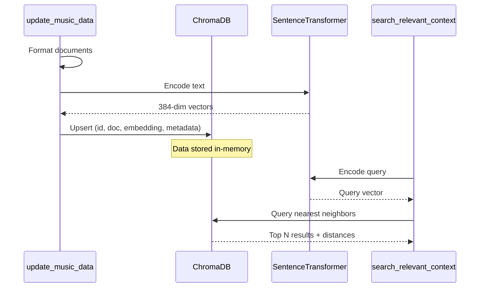

#### Search Implementation

```python
def search_relevant_context(self, query: str, n_results: int = 5) -> List[Dict]:
    """
    Semantic search over country music data.

    Note: Limited to 10 results due to HNSW index constraints.

    Args:
        query: User's search query
        n_results: Max results (capped at 10)

    Returns:
        List of {text, metadata, distance} dicts
    """
    results = self.collection.query(
        query_texts=[query],
        n_results=min(n_results, 10),  # HNSW limit
        include=["documents", "metadatas", "distances"]
    )

    contexts = []
    for i, doc in enumerate(results["documents"][0]):
        contexts.append({
            "text": doc,
            "metadata": results["metadatas"][0][i],
            "distance": results["distances"][0][i]
        })

    return contexts
```

---

## Streaming Response Pattern

### SSE (Server-Sent Events)

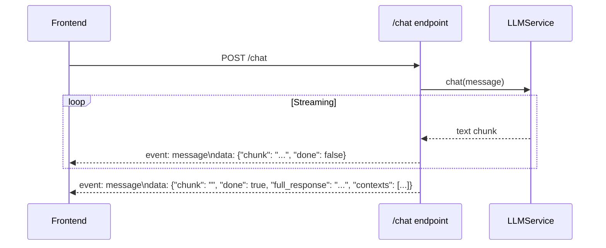

### Response Format

```python
# Streaming chunk
yield {
    "event": "message",
    "data": json.dumps({"chunk": "Hello", "done": False})
}

# Final message
yield {
    "event": "message",
    "data": json.dumps({
        "chunk": "",
        "done": True,
        "full_response": "Hello! [ACTION:SELECT_COUNTRY|JP]",
        "contexts": [...]
    })
}
```

---

## Error Handling

### LLM Fallback System

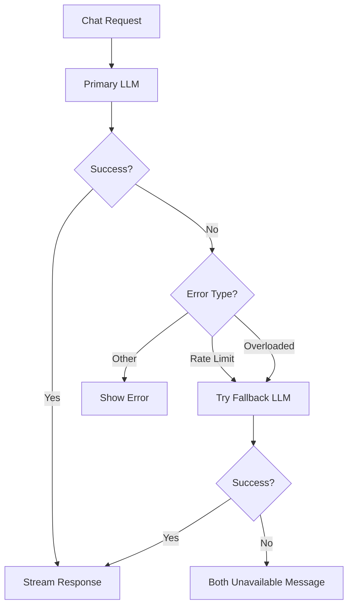

### Error Response

```python
try:
    async for chunk in selected_service.chat(...):
        yield {"event": "message", "data": json.dumps({"chunk": chunk})}
except Exception as e:
    if "overloaded" in str(e).lower() and fallback_llm_service:
        # Try fallback
        yield {"event": "message", "data": json.dumps({
            "chunk": f"Switching to {fallback_name}...",
            "done": True
        })}
        async for chunk in fallback_llm_service.chat(...):
            yield {"event": "message", "data": json.dumps({"chunk": chunk})}
    else:
        yield {"event": "message", "data": json.dumps({
            "chunk": f"⚠️ Error: {str(e)[:150]}"
        })}
```

---

## Dependencies

### File: `requirements.txt`

| Package | Version | Purpose |
|---------|---------|---------|
| fastapi | 0.109.0 | Web framework |
| uvicorn[standard] | 0.27.0 | ASGI server |
| httpx | 0.26.0 | Async HTTP client |
| python-dotenv | 1.0.0 | Environment loading |
| sse-starlette | 1.8.2 | Server-Sent Events |
| pydantic | 2.5.3 | Data validation |
| pydantic-settings | 2.1.0 | Settings management |
| chromadb | 0.4.22 | Vector database |
| openai | 1.10.0 | OpenAI API |
| anthropic | 0.18.0 | Anthropic API |
| sentence-transformers | 2.3.1 | Text embeddings |
| numpy | 1.26.3 | Numerical operations |

---

## API Reference

### GET /

Health check and service status.

**Response:**
```json
{
  "status": "ok",
  "service": "GlobeBeats API",
  "countries": 40,
  "music_source": "itunes",
  "search_enabled": true,
  "ai_enabled": true,
  "rag_stats": {
    "total_countries": 40,
    "last_updated": "2025-01-04T12:00:00.000000"
  },
  "available_llms": [
    {"id": "primary", "name": "Anthropic (Claude)", "provider": "anthropic"},
    {"id": "fallback", "name": "OpenAI (GPT-4)", "provider": "openai"}
  ]
}
```

### POST /chat

AI chat with RAG context and streaming.

**Request:**
```json
{
  "message": "What's trending in Japan?",
  "conversation_history": [
    {"role": "user", "content": "Hello"},
    {"role": "assistant", "content": "Hi! How can I help?"}
  ],
  "preferred_llm": "auto",
  "playlists": [
    {"id": "p1", "name": "My Playlist", "tracks": [...]}
  ]
}
```

**Response (SSE stream):**
```
event: message
data: {"chunk": "Japan's charts are", "done": false}

event: message
data: {"chunk": " dominated by", "done": false}

event: message
data: {"chunk": "", "done": true, "full_response": "Japan's charts are dominated by J-Pop! [ACTION:SELECT_COUNTRY|JP]", "contexts": [...]}
```

### POST /search

Search iTunes for tracks.

**Request:**
```json
{
  "query": "Taylor Swift Love Story",
  "limit": 20
}
```

**Response:**
```json
{
  "query": "Taylor Swift Love Story",
  "tracks": [
    {
      "name": "Love Story",
      "artist": "Taylor Swift",
      "preview_url": "https://audio-ssl.itunes.apple.com/...",
      "image_url": "https://is1-ssl.mzstatic.com/...",
      "external_url": "https://music.apple.com/..."
    }
  ],
  "count": 15,
  "source": "iTunes"
}
```

### GET /countries

Get all countries with trending tracks.

**Response:**
```json
[
  {
    "country_code": "JP",
    "country_name": "Japan",
    "latitude": 36.2048,
    "longitude": 138.2529,
    "flag": "🇯🇵",
    "tracks": [
      {
        "name": "Idol",
        "artist": "Yoasobi",
        "preview_url": "https://...",
        "image_url": "https://...",
        "external_url": "https://..."
      }
    ],
    "source": "itunes",
    "updated_at": "2025-01-04T12:00:00.000000"
  }
]
```

---

## Testing

### Manual API Testing

```bash
# Health check
curl http://localhost:8001/

# Get all countries
curl http://localhost:8001/countries

# Search tracks
curl -X POST http://localhost:8001/search \
  -H "Content-Type: application/json" \
  -d '{"query": "Taylor Swift", "limit": 5}'

# Chat (streaming)
curl -X POST http://localhost:8001/chat \
  -H "Content-Type: application/json" \
  -d '{"message": "play taylor swift", "conversation_history": []}'

# RAG stats
curl http://localhost:8001/rag/stats
```

### Debugging

```bash
# View backend logs
docker logs globebeats-backend-1 -f

# Check environment
docker exec globebeats-backend-1 env | grep -E "(API_KEY|LLM)"

# Test iTunes API directly
curl "https://itunes.apple.com/us/rss/topsongs/limit=10/json"
```
