# GlobeBeats Frontend Documentation

> Last Updated: 2025-01-04

## Overview

The frontend is a React 19 application with a 3D globe visualization, AI chat interface, and music player. Built with Vite for fast development and Tailwind CSS for styling.

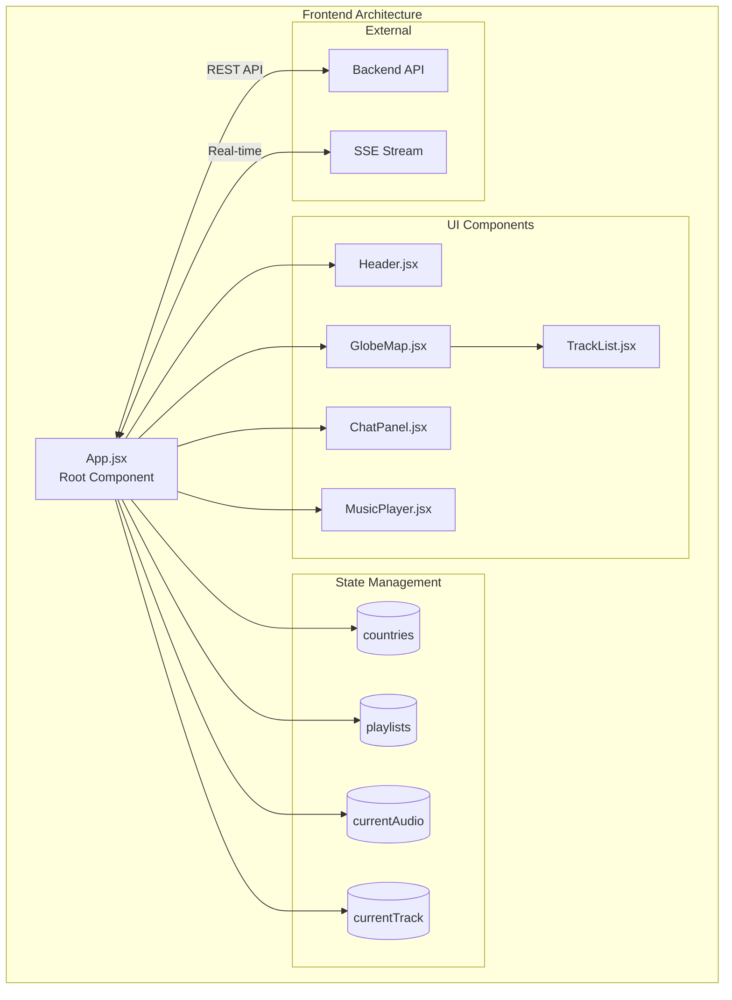

---

## File Structure

```
frontend/
├── src/
│   ├── main.jsx                    # React entry point
│   ├── App.jsx                     # Root component (480 lines)
│   ├── App.css                     # Global styles
│   ├── index.css                   # Tailwind imports
│   ├── config.js                   # API configuration
│   ├── components/
│   │   ├── Header.jsx              # App header (40 lines)
│   │   ├── GlobeMap.jsx            # 3D globe (854 lines)
│   │   ├── ChatPanel.jsx           # AI chat (859 lines)
│   │   ├── MusicPlayer.jsx         # Playback controls (268 lines)
│   │   ├── TrackList.jsx           # Track display (202 lines)
│   │   └── FrequencyVisualizer.jsx # Audio viz (disabled)
│   ├── utils/
│   │   └── countryParser.js        # Country name utilities
│   └── data/
│       └── demoScenarios.json      # Demo chat scenarios
├── package.json
├── vite.config.js
├── tailwind.config.js
├── postcss.config.js
├── Dockerfile
├── nginx.conf
└── railway.json
```

---

## Core Components

### App.jsx (Root Component)

The main application component managing global state and orchestrating child components.

#### State Variables

```javascript
// Country and music data
const [countries, setCountries] = useState([])
const [playlists, setPlaylists] = useState([])

// Connection status
const [isConnected, setIsConnected] = useState(false)
const [error, setError] = useState(null)

// Audio playback
const [currentAudio, setCurrentAudio] = useState(null)
const [currentTrack, setCurrentTrack] = useState(null)

// Playback modes
const [isAutoPlayMode, setIsAutoPlayMode] = useState(true)
const [selectedPlaylist, setSelectedPlaylist] = useState(null)
const [currentPlayingPlaylist, setCurrentPlayingPlaylist] = useState(null)
const [currentPlaylistIndex, setCurrentPlaylistIndex] = useState(0)

// Filtering
const [trackFilter, setTrackFilter] = useState(null)
```

#### Refs

| Ref | Type | Purpose |
|-----|------|---------|
| `globeMapRef` | `GlobeMap` | Control globe zoom/select |
| `isAutoPlayModeRef` | `boolean` | Persist auto-play across renders |
| `currentPlayingPlaylistRef` | `Playlist` | Current playlist reference |
| `currentPlaylistIndexRef` | `number` | Current track index |
| `audioUnlockedRef` | `boolean` | Browser audio unlocked |

#### Component Hierarchy

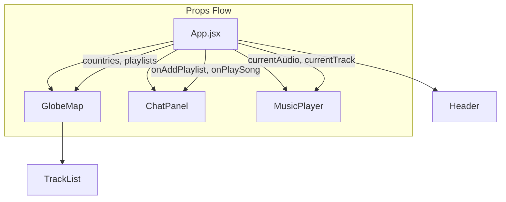

#### Key Functions

##### `handlePlaySong(countryCode, trackName, artistName, isAutoPlay, previewUrl, playlistContext, imageUrl)`

Central playback handler managing all audio playback scenarios.

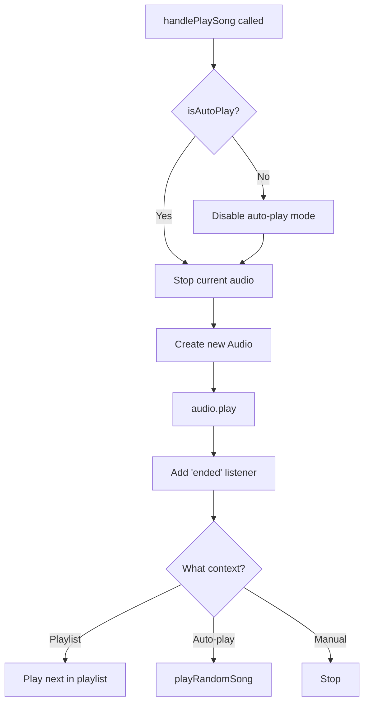

```javascript
const handlePlaySong = (countryCode, trackName, artistName,
                        isAutoPlay = false, previewUrl = null,
                        playlistContext = null, imageUrl = null) => {
  // CRITICAL: Manual play disables auto-play permanently
  if (!isAutoPlay) {
    setIsAutoPlayMode(false)
    isAutoPlayModeRef.current = false
  }

  // Track playlist context
  if (playlistContext) {
    setCurrentPlayingPlaylist(playlistContext.playlist)
    setCurrentPlaylistIndex(playlistContext.index)
  }

  // Stop current audio
  if (currentAudio) {
    currentAudio.pause()
  }

  // Create and play new audio
  const audio = new Audio(previewUrl)
  audio.play()
  setCurrentAudio(audio)
  setCurrentTrack({ countryCode, trackName, artistName, imageUrl })

  // Handle track end
  audio.addEventListener('ended', () => {
    if (playlistContext) {
      // Play next track in playlist
      const nextIndex = playlistContext.index + 1
      if (nextIndex < playlistContext.playlist.tracks.length) {
        const nextTrack = playlistContext.playlist.tracks[nextIndex]
        handlePlaySong('PLAYLIST', nextTrack.name, nextTrack.artist,
                       false, nextTrack.preview_url,
                       { playlist: playlistContext.playlist, index: nextIndex })
      }
    } else if (isAutoPlayModeRef.current) {
      // Auto-play random song
      setTimeout(() => playRandomSong(), 1000)
    }
  })

  // Zoom to country
  if (countryCode !== 'PLAYLIST' && globeMapRef.current) {
    globeMapRef.current.selectCountry(countryCode)
  }
}
```

##### `handleAddPlaylist(playlistName, tracks)`

Creates a new playlist from AI-generated or searched tracks.

```javascript
const handleAddPlaylist = (playlistName, tracks) => {
  const newPlaylist = {
    id: `playlist_${Date.now()}`,
    name: playlistName,
    tracks: tracks,
    created_at: new Date().toISOString()
  }

  setPlaylists(prev => [...prev, newPlaylist])
  setSelectedPlaylist(newPlaylist)

  return newPlaylist  // Return for caller to auto-play
}
```

##### Audio Unlock Pattern

Browsers require user gesture before playing audio. This pattern unlocks audio on first interaction.

```javascript
useEffect(() => {
  const unlockAudio = () => {
    if (audioUnlockedRef.current) return

    // Play silent audio to unlock AudioContext
    const silentAudio = new Audio(
      'data:audio/wav;base64,UklGRigAAABXQVZFZm10IBAAAA...'
    )
    silentAudio.play().then(() => {
      audioUnlockedRef.current = true
      window.removeEventListener('click', unlockAudio)
      window.removeEventListener('keydown', unlockAudio)
    }).catch(() => {})
  }

  window.addEventListener('click', unlockAudio)
  window.addEventListener('keydown', unlockAudio)

  return () => {
    window.removeEventListener('click', unlockAudio)
    window.removeEventListener('keydown', unlockAudio)
  }
}, [])
```

##### SSE Connection

Real-time updates from backend via Server-Sent Events.

```javascript
useEffect(() => {
  const eventSource = new EventSource(`${API_BASE_URL}/stream`)

  eventSource.addEventListener('update', (event) => {
    const data = JSON.parse(event.data)
    setCountries(data)
    setIsConnected(true)
  })

  eventSource.onerror = () => {
    setIsConnected(false)
  }

  return () => eventSource.close()
}, [])
```

---

### GlobeMap.jsx (3D Globe)

Interactive 3D globe visualization using react-globe.gl with country markers and sidebars.

#### State

```javascript
const [selectedCountry, setSelectedCountry] = useState(null)
const [isInteracting, setIsInteracting] = useState(false)
const [showCountryList, setShowCountryList] = useState(true)
const [showPlaylistsSection, setShowPlaylistsSection] = useState(true)
const [countrySearchTerm, setCountrySearchTerm] = useState('')
const [isMobile, setIsMobile] = useState(window.innerWidth < 900)
```

#### Imperative Handle (Parent API)

```javascript
useImperativeHandle(ref, () => ({
  selectCountry: (countryCode) => {
    const country = countries.find(c => c.country_code === countryCode)
    if (country && globeEl.current) {
      setSelectedCountry(country)
      globeEl.current.pointOfView({
        lat: country.latitude,
        lng: country.longitude,
        altitude: 1.5
      }, 1200)  // 1.2 second animation
    }
  }
}))
```

#### Globe Configuration

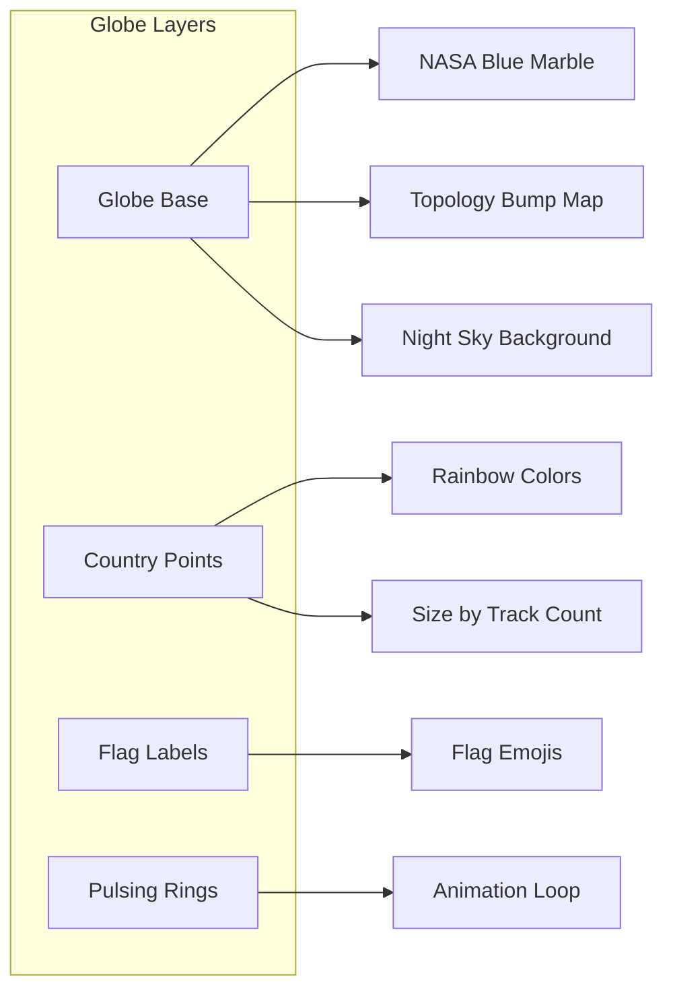

```jsx
<Globe
  ref={globeEl}
  globeImageUrl="//unpkg.com/three-globe/example/img/earth-blue-marble.jpg"
  bumpImageUrl="//unpkg.com/three-globe/example/img/earth-topology.png"
  backgroundImageUrl="//unpkg.com/three-globe/example/img/night-sky.png"

  // Country points
  pointsData={countries}
  pointLat={d => d.latitude}
  pointLng={d => d.longitude}
  pointColor={d => COLORS[d.index % 8]}
  pointRadius={d => 0.3 + d.tracks.length * 0.05}

  // Flag labels
  labelsData={countries}
  labelText={d => d.flag}
  labelSize={1.5}

  // Pulsing rings
  ringsData={countries.filter(c => c.tracks.length > 0)}
  ringColor={() => t => `rgba(255,255,255,${1-t})`}
  ringMaxRadius={3}
  ringPropagationSpeed={1}

  // Auto-rotation
  autoRotate={!isInteracting}
  autoRotateSpeed={0.5}

  // Controls
  enableZoom={true}
  minZoom={180}
  maxZoom={600}

  // Events
  onPointClick={handleCountryClick}
  onGlobeClick={() => setSelectedCountry(null)}
/>
```

#### Layout Structure

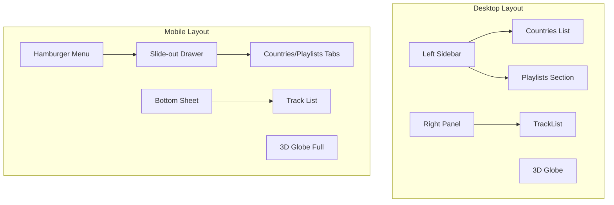

---

### ChatPanel.jsx (AI Chat)

AI chat interface with demo mode and action execution.

#### State

```javascript
const [isOpen, setIsOpen] = useState(false)
const [messages, setMessages] = useState([{ role: 'assistant', content: '...' }])
const [input, setInput] = useState('')
const [isLoading, setIsLoading] = useState(false)
const [selectedLLM, setSelectedLLM] = useState('auto')
const [availableLLMs, setAvailableLLMs] = useState([])

// Demo mode
const [selectedDemo, setSelectedDemo] = useState('')
const [isPlayingDemo, setIsPlayingDemo] = useState(false)
const [demoProgress, setDemoProgress] = useState({ current: 0, total: 0 })

// Refs
const executedActionsRef = useRef(new Set())  // Prevent duplicate actions
const stopDemoRef = useRef(false)
```

#### Action Execution Flow

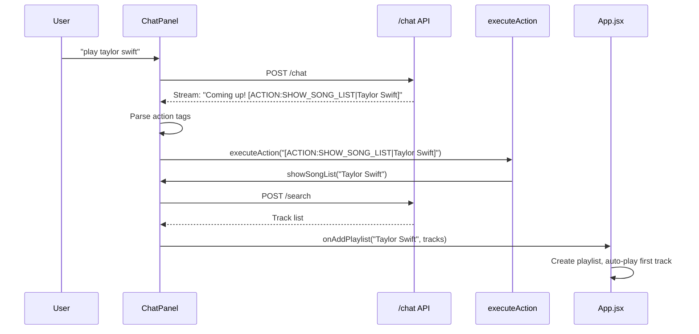

#### Key Functions

##### `executeAction(actionString)`

Parses and executes action tags from LLM responses.

```javascript
const executeAction = (actionString) => {
  // Parse: [ACTION:TYPE|param1|param2]
  const match = actionString.match(/\[ACTION:(\w+)\|([^\]]+)\]/)
  if (!match) return

  const [, actionType, params] = match
  const parts = params.split('|')

  switch (actionType) {
    case 'SELECT_COUNTRY':
      onSelectCountry(parts[0])
      break

    case 'SHOW_SONG_LIST':
      showSongList(parts[0])
      break

    case 'SEARCH_AND_PLAY':
      onSearchAndPlay(parts[0])
      break

    case 'PLAY_SONG':
      playSong(parts[0], parts[1], parts[2])
      break
  }
}
```

##### `showSongList(query)`

Creates playlist from iTunes search.

```javascript
const showSongList = async (query) => {
  try {
    const response = await fetch(`${API_BASE_URL}/search`, {
      method: 'POST',
      headers: { 'Content-Type': 'application/json' },
      body: JSON.stringify({ query, limit: 20 })
    })

    const data = await response.json()

    if (data.tracks && data.tracks.length > 0) {
      const playlist = onAddPlaylist(query, data.tracks)

      // Auto-play first track with preview
      const firstTrack = playlist.tracks.find(t => t.preview_url)
      if (firstTrack) {
        onPlaySong('PLAYLIST', firstTrack.name, firstTrack.artist,
                   false, firstTrack.preview_url,
                   { playlist, index: 0 }, firstTrack.image_url)
      }
    }
  } catch (error) {
    console.error('Search failed:', error)
  }
}
```

##### `handleSubmit(e)`

Handles chat message submission with streaming.

```javascript
const handleSubmit = async (e) => {
  e.preventDefault()
  if (!input.trim() || isLoading) return

  const userMessage = input.trim()
  setInput('')
  setIsLoading(true)
  setMessages(prev => [...prev, { role: 'user', content: userMessage }])

  // Build conversation history (last 5 messages)
  const history = messages.slice(-5).map(m => ({
    role: m.role,
    content: m.content.replace(/\[ACTION:[^\]]+\]/g, '')  // Strip actions
  }))

  try {
    const response = await fetch(`${API_BASE_URL}/chat`, {
      method: 'POST',
      headers: { 'Content-Type': 'application/json' },
      body: JSON.stringify({
        message: userMessage,
        conversation_history: history,
        preferred_llm: selectedLLM,
        playlists: playlists
      })
    })

    const reader = response.body.getReader()
    const decoder = new TextDecoder()
    let assistantMessage = ''

    setMessages(prev => [...prev, { role: 'assistant', content: '', isStreaming: true }])

    while (true) {
      const { done, value } = await reader.read()
      if (done) break

      const chunk = decoder.decode(value)
      const lines = chunk.split('\n')

      for (const line of lines) {
        if (line.startsWith('data: ')) {
          const data = JSON.parse(line.slice(6))

          if (data.chunk) {
            assistantMessage += data.chunk
            setMessages(prev => {
              const newMessages = [...prev]
              newMessages[newMessages.length - 1] = {
                role: 'assistant',
                content: assistantMessage,
                isStreaming: !data.done
              }
              return newMessages
            })
          }

          if (data.done && data.full_response) {
            // Execute unique actions
            const actions = assistantMessage.match(/\[ACTION:\w+\|[^\]]+\]/g) || []
            const uniqueActions = [...new Set(actions)]
            uniqueActions.forEach(action => {
              if (!executedActionsRef.current.has(action)) {
                executeAction(action)
                executedActionsRef.current.add(action)
              }
            })
          }
        }
      }
    }
  } catch (error) {
    setMessages(prev => [...prev, {
      role: 'assistant',
      content: `⚠️ Error: ${error.message}`
    }])
  } finally {
    setIsLoading(false)
  }
}
```

#### Demo System

Pre-configured chat scenarios for demonstration.

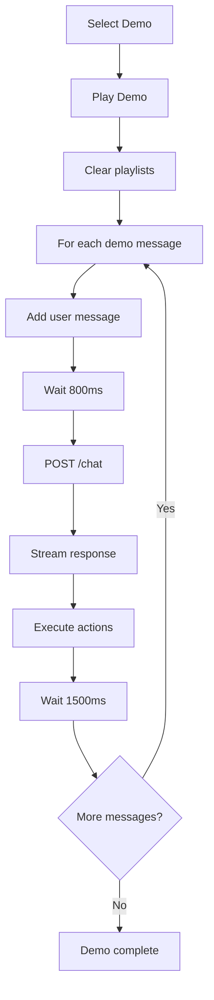

---

### MusicPlayer.jsx (Playback Controls)

Audio player with progress bar and controls.

#### State

```javascript
const [isPlaying, setIsPlaying] = useState(false)
const [currentTime, setCurrentTime] = useState(0)
const [duration, setDuration] = useState(0)
const [isDragging, setIsDragging] = useState(false)
const [shouldScrollTitle, setShouldScrollTitle] = useState(false)
const [shouldScrollArtist, setShouldScrollArtist] = useState(false)
```

#### Audio Event Listeners

```javascript
useEffect(() => {
  if (!currentAudio) return

  const handleTimeUpdate = () => setCurrentTime(currentAudio.currentTime)
  const handleLoadedMetadata = () => setDuration(currentAudio.duration)
  const handlePlay = () => setIsPlaying(true)
  const handlePause = () => setIsPlaying(false)
  const handleEnded = () => setIsPlaying(false)

  currentAudio.addEventListener('timeupdate', handleTimeUpdate)
  currentAudio.addEventListener('loadedmetadata', handleLoadedMetadata)
  currentAudio.addEventListener('play', handlePlay)
  currentAudio.addEventListener('playing', handlePlay)
  currentAudio.addEventListener('pause', handlePause)
  currentAudio.addEventListener('ended', handleEnded)

  return () => {
    currentAudio.removeEventListener('timeupdate', handleTimeUpdate)
    // ... remove all listeners
  }
}, [currentAudio])
```

#### Layout

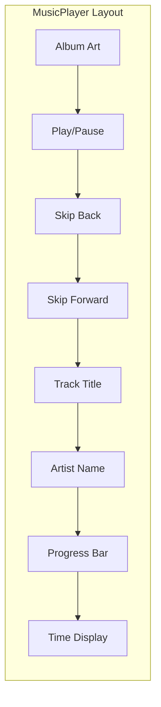

---

### TrackList.jsx (Track Display)

Displays tracks for selected country or playlist.

#### Props

```typescript
interface TrackListProps {
  country?: CountryMusic       // Country tracks
  playlist?: Playlist          // Playlist tracks
  currentTrack?: Track         // Currently playing
  trackFilter?: string         // Search filter
  onPlaySong: Function         // Play callback
}
```

#### Track Display Logic

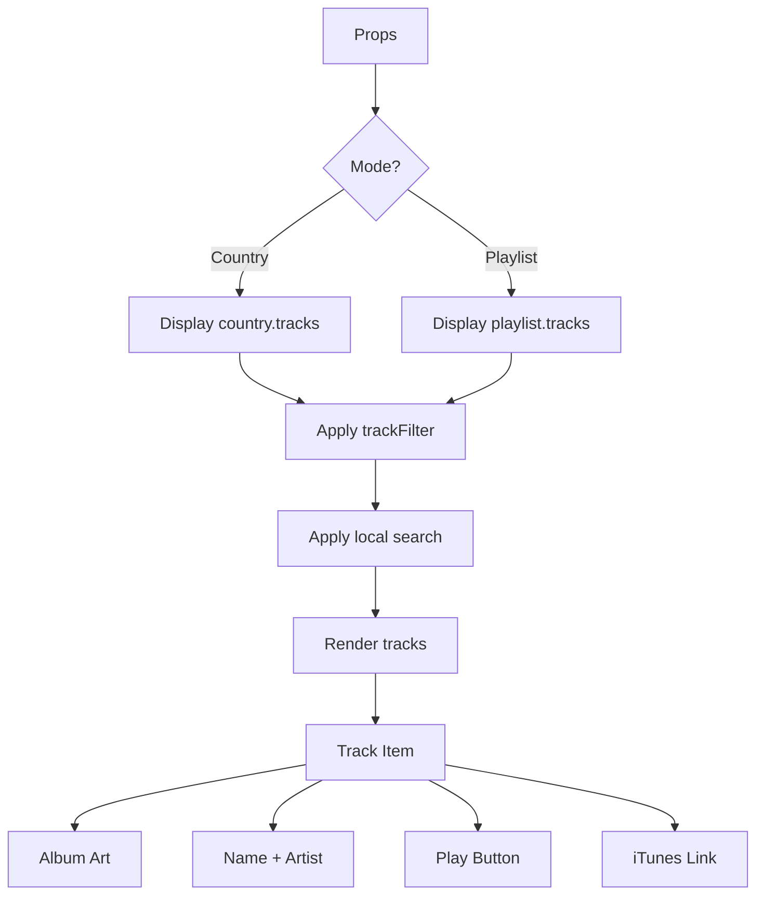

#### Play Handler

```javascript
const handlePlayPreview = (track, index) => {
  if (playlist) {
    // Playlist mode: pass context for sequential playback
    onPlaySong(
      'PLAYLIST',
      track.name,
      track.artist,
      false,  // Not auto-play
      track.preview_url,
      { playlist, index },  // Context for next track
      track.image_url
    )
  } else if (country) {
    // Country mode: single track
    onPlaySong(
      country.country_code,
      track.name,
      track.artist,
      false,
      track.preview_url,
      null,
      track.image_url
    )
  }
}
```

---

### Header.jsx

Simple header with logo and connection status.

```jsx
const Header = ({ isConnected, error }) => {
  return (
    <header className="fixed top-0 left-0 right-0 z-50 p-4">
      <div className="flex items-center gap-2">
        <span className="text-2xl">🌍</span>
        <h1 className="text-xl font-bold text-white">GlobeBeats</h1>

        {/* Connection indicator */}
        <div className={`w-2 h-2 rounded-full ${
          isConnected ? 'bg-green-500 animate-pulse' : 'bg-gray-500'
        }`} />

        {error && <span className="text-red-400 text-sm">{error}</span>}
      </div>
    </header>
  )
}
```

---

### FrequencyVisualizer.jsx (Disabled)

Audio frequency visualization - currently disabled due to CORS restrictions on iTunes preview URLs.

```javascript
// DISABLED: iTunes audio CORS prevents AudioContext access
// createMediaElementSource() requires same-origin audio

// When enabled, would display:
// - Rainbow gradient bars
// - Animated to audio frequencies
// - Canvas-based rendering
```

---

## Utilities

### countryParser.js

Country name and flag utilities.

```javascript
// Country name to ISO code mapping
export const COUNTRY_MAP = {
  'United States': 'US',
  'United Kingdom': 'GB',
  'Japan': 'JP',
  'South Korea': 'KR',
  // ... 40+ countries
}

/**
 * Find country codes mentioned in text.
 * Handles both country names and flag emojis.
 */
export const findCountriesInText = (text) => {
  const found = []

  // Check for country names
  for (const [name, code] of Object.entries(COUNTRY_MAP)) {
    if (text.toLowerCase().includes(name.toLowerCase())) {
      found.push(code)
    }
  }

  // Check for flag emojis
  const flagRegex = /[\uD83C][\uDDE6-\uDDFF][\uD83C][\uDDE6-\uDDFF]/g
  const flags = text.match(flagRegex) || []
  flags.forEach(flag => {
    const code = flagToCountryCode(flag)
    if (code) found.push(code)
  })

  return [...new Set(found)]
}

/**
 * Convert flag emoji to ISO country code.
 * Uses Unicode codepoint math.
 */
export const flagToCountryCode = (flag) => {
  const codePoints = [...flag].map(c => c.codePointAt(0))
  const letters = codePoints.map(cp => String.fromCharCode(cp - 127397))
  return letters.join('')
}

/**
 * Get country name from code.
 */
export const getCountryName = (code, countries) => {
  const country = countries.find(c => c.country_code === code)
  return country?.country_name || code
}
```

---

## Data Flow

### Initial Load

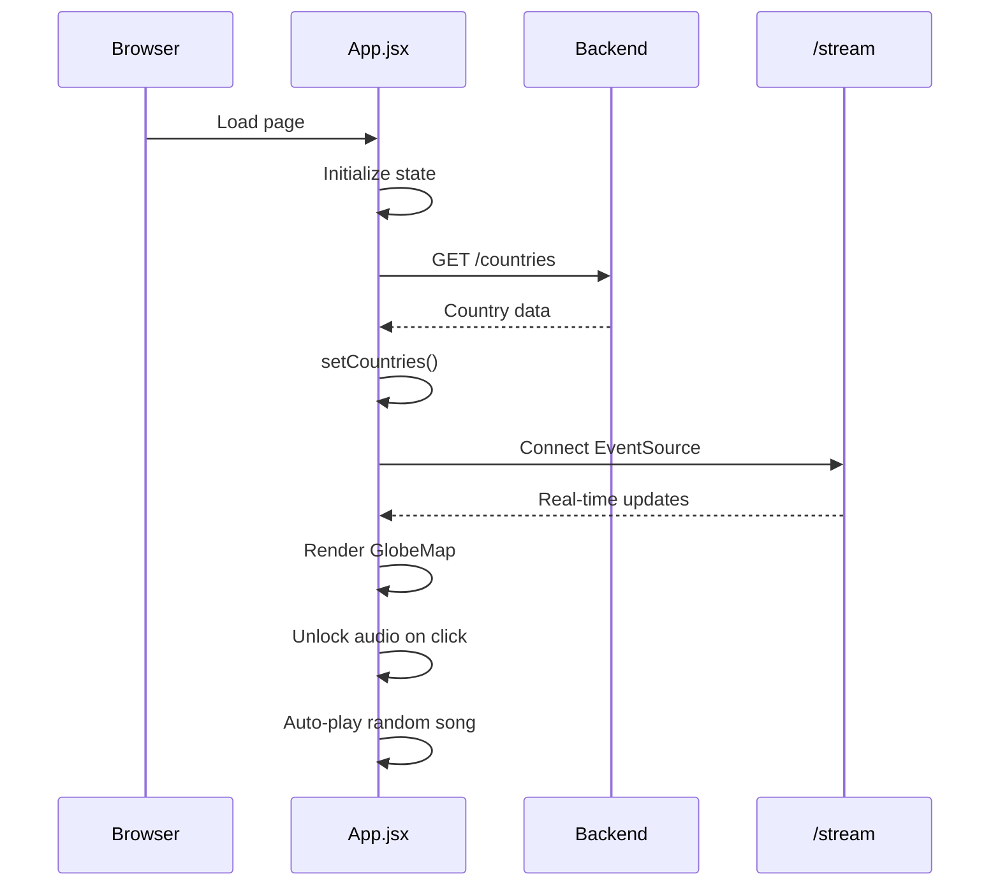

### Chat & Playlist Creation

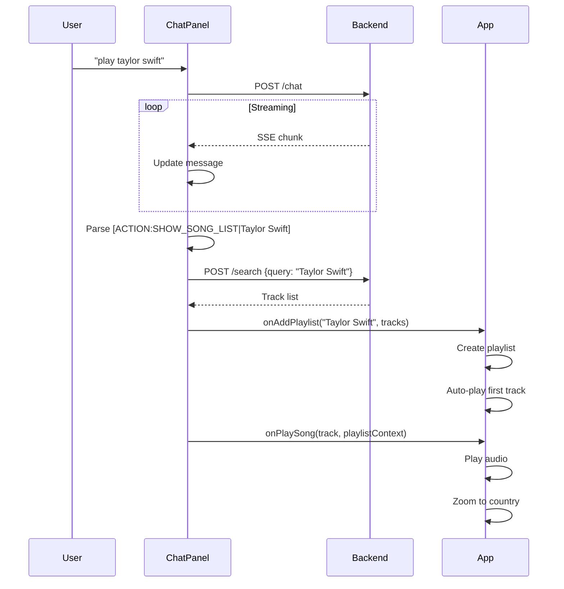

### Playback States

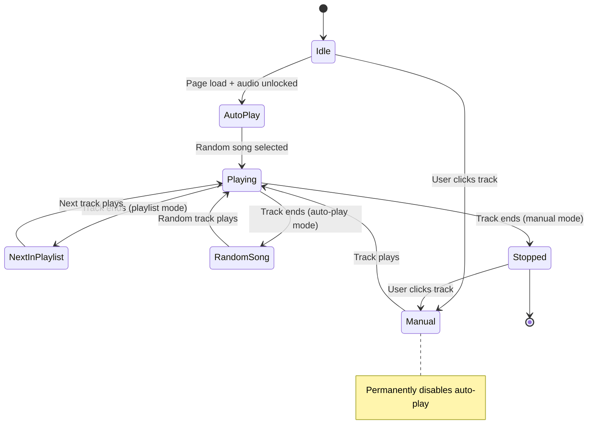

---

## Responsive Design

### Breakpoints

| Width | Mode | Layout Changes |
|-------|------|----------------|
| < 900px | Mobile | Hamburger menu, drawers, bottom sheets |
| >= 900px | Desktop | Fixed sidebars, floating panels |

### Mobile Adaptations

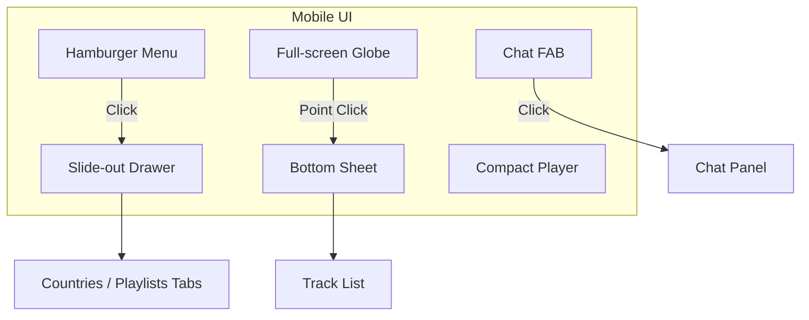

---

## Configuration

### config.js

```javascript
export const API_BASE_URL = import.meta.env.VITE_API_URL || 'http://localhost:8001'
```

### vite.config.js

```javascript
import { defineConfig } from 'vite'
import react from '@vitejs/plugin-react'

export default defineConfig({
  plugins: [react()],
  server: {
    host: true,
    port: 5173
  }
})
```

### tailwind.config.js

```javascript
export default {
  content: ['./index.html', './src/**/*.{js,ts,jsx,tsx}'],
  theme: {
    extend: {
      animation: {
        'marquee': 'marquee 10s linear infinite',
        'slide-in': 'slideIn 0.3s ease-out',
        'slide-up': 'slideUp 0.3s ease-out',
        'chat-appear': 'chatAppear 0.2s ease-out',
      }
    }
  },
  plugins: []
}
```

---

## Dependencies

### package.json

| Package | Version | Purpose |
|---------|---------|---------|
| react | 19.2.0 | UI framework |
| react-dom | 19.2.0 | DOM rendering |
| react-globe.gl | 2.37.0 | 3D globe visualization |
| three | (peer) | 3D rendering engine |
| leaflet | 1.9.4 | Map utilities (unused) |

### Dev Dependencies

| Package | Version | Purpose |
|---------|---------|---------|
| vite | 7.2.4 | Build tool |
| @vitejs/plugin-react | 4.6.0 | React plugin |
| tailwindcss | 3.4.1 | CSS framework |
| postcss | 8.4.35 | CSS processing |
| autoprefixer | 10.4.18 | CSS prefixing |
| eslint | 9.25.0 | Linting |

---

## Testing

### Manual Testing

```bash
# Start frontend dev server
npm run dev

# Build production
npm run build

# Preview production build
npm run preview

# Lint code
npm run lint
```

### Key Test Scenarios

1. **Globe Interaction**
   - Click country point → Zoom + show tracks
   - Drag/scroll → Pause auto-rotation
   - Click empty space → Close panel

2. **Chat**
   - Submit message → Stream response
   - Action tag → Execute action
   - Demo mode → Automated scenarios

3. **Playback**
   - Click track → Play audio
   - Playlist mode → Sequential playback
   - Auto-play → Random trending songs

4. **Responsive**
   - Resize < 900px → Mobile layout
   - Hamburger menu → Drawer opens
   - Track panel → Bottom sheet

---

## Known Issues

1. **FrequencyVisualizer Disabled**
   - CORS restrictions on iTunes audio
   - `createMediaElementSource()` fails cross-origin

2. **Auto-play Blocked**
   - Browsers block audio until user gesture
   - Workaround: Silent audio on first click

3. **SSE Reconnection**
   - No automatic reconnection on disconnect
   - Page refresh required

4. **Mobile Performance**
   - 3D globe can be heavy on older devices
   - Consider reducing point count
