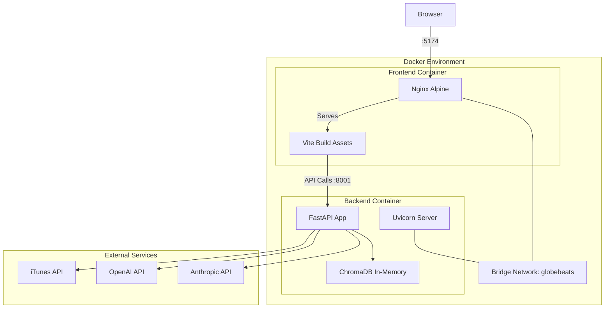
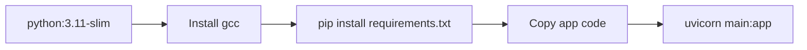
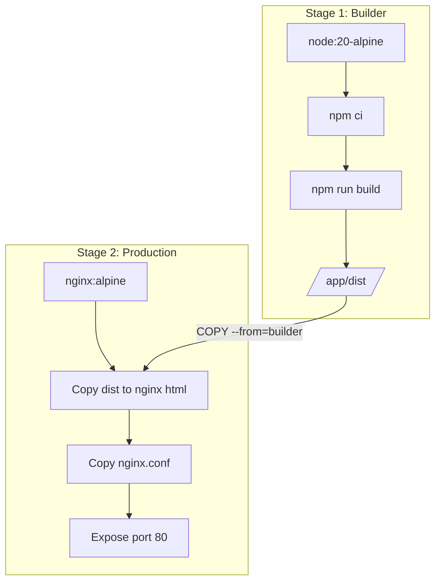
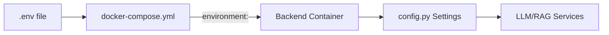
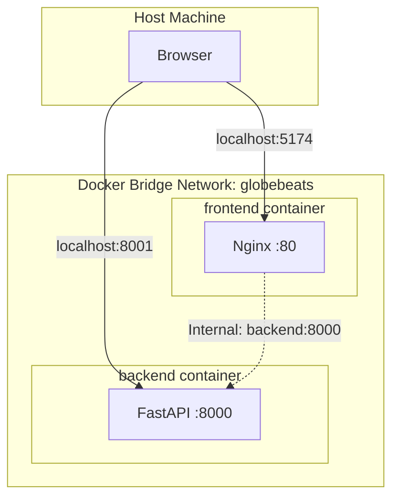
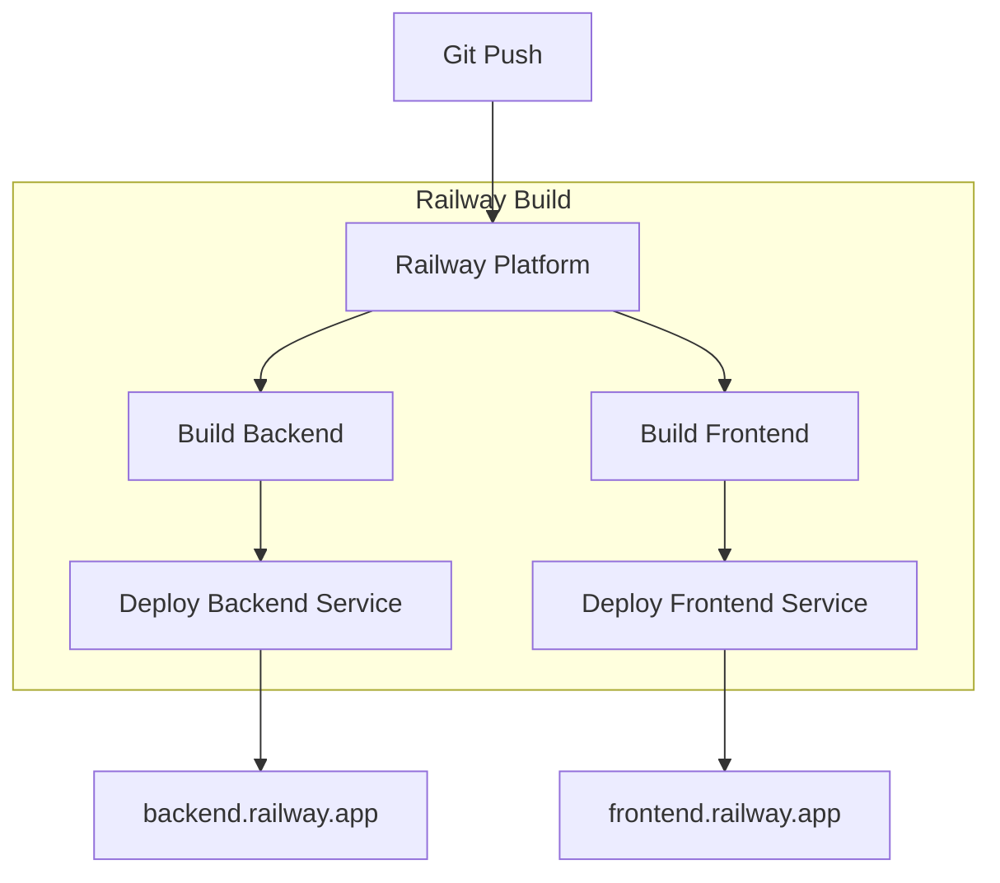
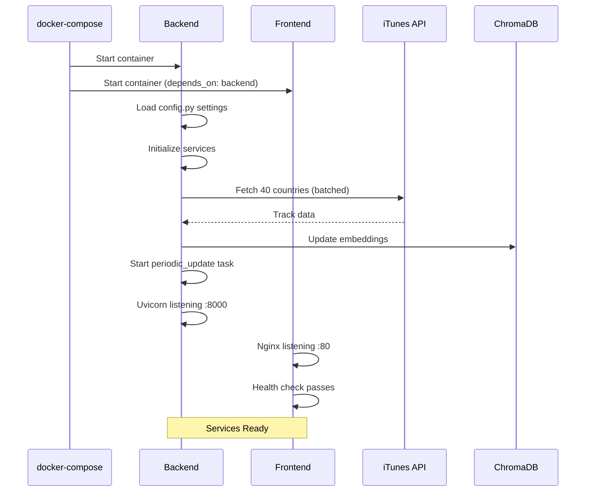

# GlobeBeats Infrastructure Documentation

> Last Updated: 2025-01-04

## Overview

GlobeBeats uses a containerized microservices architecture with Docker Compose for local development and Railway for production deployment.



---

## File Structure

```
GlobeBeats/
├── docker-compose.yml          # Service orchestration
├── backend/
│   ├── Dockerfile              # Python 3.11 slim image
│   └── railway.json            # Railway deployment config
├── frontend/
│   ├── Dockerfile              # Multi-stage Node + Nginx
│   ├── nginx.conf              # Nginx configuration
│   └── railway.json            # Railway deployment config
└── .env                        # Environment variables (not in git)
```

---

## Docker Compose Configuration

### File: `docker-compose.yml`

```yaml
version: '3.8'

services:
  backend:
    build:
      context: ./backend
      dockerfile: Dockerfile
    ports:
      - "8001:8000"
    environment:
      - OPENAI_API_KEY=${OPENAI_API_KEY:-}
      - ANTHROPIC_API_KEY=${ANTHROPIC_API_KEY:-}
      - LLM_PROVIDER=${LLM_PROVIDER:-openai}
      - LLM_MODEL=${LLM_MODEL:-gpt-4-turbo-preview}
      - CORS_ORIGINS=http://localhost:5174
      - UPDATE_INTERVAL=300
    volumes:
      - ./backend:/app
    restart: unless-stopped
    networks:
      - globebeats

  frontend:
    build:
      context: ./frontend
      dockerfile: Dockerfile
    ports:
      - "5174:80"
    depends_on:
      - backend
    restart: unless-stopped
    networks:
      - globebeats

networks:
  globebeats:
    driver: bridge
```

### Service Details

| Service | Image Base | Internal Port | External Port | Purpose |
|---------|------------|---------------|---------------|---------|
| backend | python:3.11-slim | 8000 | 8001 | FastAPI + RAG |
| frontend | nginx:alpine | 80 | 5174 | Static assets |

---

## Backend Dockerfile

### File: `backend/Dockerfile`

```dockerfile
FROM python:3.11-slim

WORKDIR /app

# Install build dependencies
RUN apt-get update && apt-get install -y \
    gcc \
    && rm -rf /var/lib/apt/lists/*

# Install Python dependencies
COPY requirements.txt .
RUN pip install --no-cache-dir -r requirements.txt

# Copy application code
COPY . .

# Expose port
EXPOSE 8000

# Start server
CMD ["sh", "-c", "uvicorn main:app --host 0.0.0.0 --port ${PORT:-8000}"]
```

### Build Flow



### Key Dependencies

| Package | Version | Purpose |
|---------|---------|---------|
| fastapi | 0.109.0 | Web framework |
| uvicorn | 0.27.0 | ASGI server |
| chromadb | 0.4.22 | Vector database |
| openai | 1.10.0 | GPT-4 API |
| anthropic | 0.18.0 | Claude API |
| sentence-transformers | 2.3.1 | Embeddings |
| sse-starlette | 1.8.2 | Server-Sent Events |

---

## Frontend Dockerfile

### File: `frontend/Dockerfile`

```dockerfile
# Build stage
FROM node:20-alpine AS builder
WORKDIR /app
COPY package*.json ./
RUN npm ci
COPY . .
RUN npm run build

# Production stage
FROM nginx:alpine
COPY --from=builder /app/dist /usr/share/nginx/html
COPY nginx.conf /etc/nginx/conf.d/default.conf
EXPOSE 80
HEALTHCHECK --interval=30s --timeout=3s --start-period=5s --retries=3 \
    CMD wget --no-verbose --tries=1 --spider http://localhost/ || exit 1
CMD ["nginx", "-g", "daemon off;"]
```

### Multi-Stage Build Flow



---

## Nginx Configuration

### File: `frontend/nginx.conf`

```nginx
server {
    listen 80;
    server_name _;
    root /usr/share/nginx/html;
    index index.html;

    # Gzip compression
    gzip on;
    gzip_vary on;
    gzip_min_length 1024;
    gzip_types text/plain text/css text/xml text/javascript
               application/x-javascript application/xml+rss
               application/javascript application/json;

    # Security headers
    add_header X-Frame-Options "SAMEORIGIN" always;
    add_header X-Content-Type-Options "nosniff" always;
    add_header X-XSS-Protection "1; mode=block" always;

    # Cache static assets
    location /assets/ {
        expires 1y;
        add_header Cache-Control "public, immutable";
    }

    # SPA routing - always serve index.html
    location / {
        try_files $uri $uri/ /index.html;
    }

    # Health check endpoint
    location /health {
        access_log off;
        return 200 "healthy\n";
        add_header Content-Type text/plain;
    }
}
```

### Nginx Features

| Feature | Configuration | Purpose |
|---------|--------------|---------|
| Gzip | Enabled, min 1024 bytes | Reduce transfer size |
| Security Headers | X-Frame-Options, X-XSS-Protection | Prevent attacks |
| Asset Caching | 1 year for /assets/ | CDN-friendly |
| SPA Routing | try_files → index.html | Client-side routing |
| Health Check | /health endpoint | Container health |

---

## Environment Variables

### File: `.env` (template)

```bash
# LLM Configuration
LLM_PROVIDER=anthropic          # or "openai"
LLM_MODEL=claude-sonnet-4-20250514
OPENAI_API_KEY=sk-...
ANTHROPIC_API_KEY=sk-ant-...

# Optional: Fallback LLM
OPENAI_MODEL=gpt-4-turbo-preview
ANTHROPIC_MODEL=claude-sonnet-4-20250514

# App Configuration
CORS_ORIGINS=http://localhost:5174
UPDATE_INTERVAL=300             # Music data refresh (seconds)

# Legacy (not used)
SPOTIFY_CLIENT_ID=
SPOTIFY_CLIENT_SECRET=
LASTFM_API_KEY=
```

### Environment Flow



---

## Network Architecture



### Port Mapping

| Host Port | Container | Internal Port | Protocol |
|-----------|-----------|---------------|----------|
| 5174 | frontend | 80 | HTTP |
| 8001 | backend | 8000 | HTTP |

---

## Railway Deployment

### Backend: `backend/railway.json`

```json
{
  "$schema": "https://railway.app/railway.schema.json",
  "build": {
    "builder": "DOCKERFILE",
    "dockerfilePath": "backend/Dockerfile"
  },
  "deploy": {
    "restartPolicyType": "ON_FAILURE",
    "restartPolicyMaxRetries": 10
  }
}
```

### Frontend: `frontend/railway.json`

```json
{
  "$schema": "https://railway.app/railway.schema.json",
  "build": {
    "builder": "DOCKERFILE",
    "dockerfilePath": "frontend/Dockerfile"
  },
  "deploy": {
    "restartPolicyType": "ON_FAILURE",
    "restartPolicyMaxRetries": 10
  }
}
```

### Railway Deployment Flow



---

## Development Commands

### Local Development

```bash
# Start all services
docker-compose up -d --build

# View logs
docker-compose logs -f

# Restart specific service
docker-compose restart backend

# Stop all services
docker-compose down

# Rebuild and restart
docker-compose down && docker-compose up -d --build
```

### Container Management

```bash
# Check running containers
docker-compose ps

# Execute command in container
docker exec -it globebeats-backend-1 bash
docker exec -it globebeats-frontend-1 sh

# View container logs
docker logs globebeats-backend-1 --tail=50
docker logs globebeats-frontend-1 --tail=50
```

### Health Checks

```bash
# Backend health
curl http://localhost:8001/

# Frontend health
curl http://localhost:5174/health

# Full status check
curl -s http://localhost:8001/ | jq
```

---

## Startup Sequence



### Startup Timeline

| Time | Backend | Frontend |
|------|---------|----------|
| 0s | Container starts | Container starts |
| 1s | Load dependencies | Nginx ready |
| 2s | Initialize services | Health check active |
| 5-30s | Fetch iTunes data (40 countries) | Serving static files |
| 30s+ | RAG database ready | - |
| 30s+ | API endpoints active | - |

---

## Troubleshooting

### Common Issues

| Issue | Symptom | Solution |
|-------|---------|----------|
| Port conflict | "Address already in use" | `lsof -i :5174` then kill process |
| Backend slow start | curl returns empty | Wait 30s for iTunes fetch |
| CORS errors | Browser console errors | Check CORS_ORIGINS in .env |
| No AI responses | Chat returns error | Verify API keys in .env |

### Debug Commands

```bash
# Check if ports are in use
lsof -i :5174
lsof -i :8001

# Verify environment variables loaded
docker exec globebeats-backend-1 env | grep -E "(API_KEY|LLM)"

# Test backend directly
curl -X POST http://localhost:8001/chat \
  -H "Content-Type: application/json" \
  -d '{"message": "hello", "conversation_history": []}'

# Check ChromaDB status
curl http://localhost:8001/rag/stats
```

---

## Resource Requirements

### Minimum Requirements

| Resource | Backend | Frontend |
|----------|---------|----------|
| Memory | 512MB | 64MB |
| CPU | 0.5 cores | 0.1 cores |
| Disk | 500MB (dependencies) | 50MB (build) |

### Production Recommendations

| Resource | Backend | Frontend |
|----------|---------|----------|
| Memory | 2GB | 128MB |
| CPU | 2 cores | 0.5 cores |
| Disk | 1GB | 100MB |

---

## Security Considerations

1. **API Keys**: Never commit `.env` to git
2. **CORS**: Restrict `CORS_ORIGINS` in production
3. **Network**: Use internal Docker network for service communication
4. **Headers**: Nginx adds security headers (X-Frame-Options, etc.)
5. **No Auth**: Current setup has no authentication (demo only)
